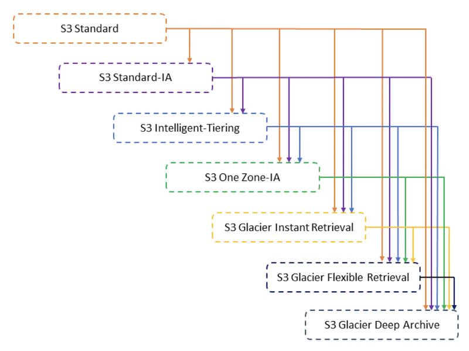
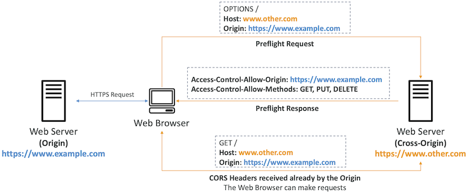
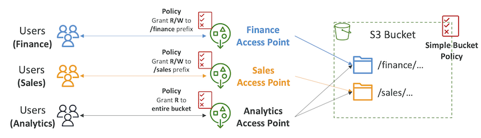
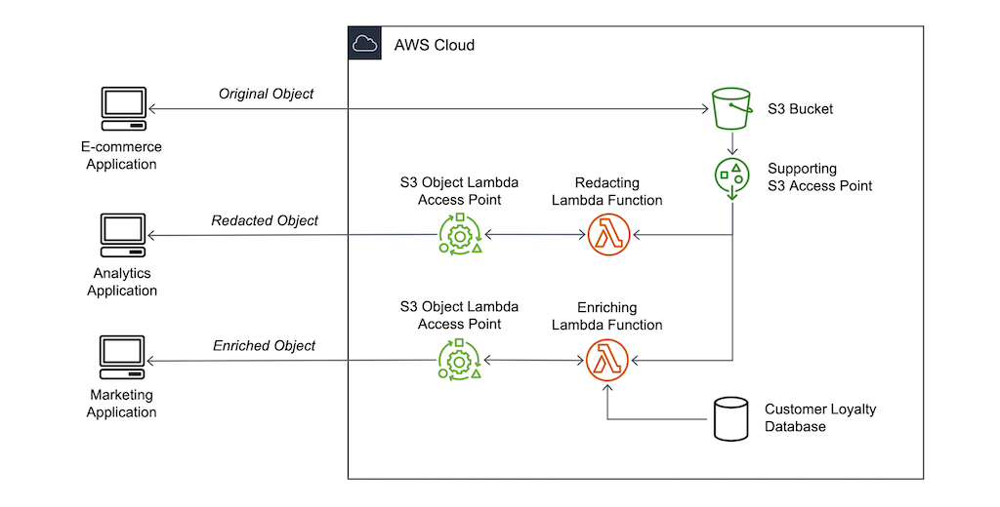

# Advanced S3

- [Advanced S3](#advanced-s3)
  - [Amazon S3 - Moving between Storage Classes](#amazon-s3---moving-between-storage-classes)
  - [Amazon S3 - Lifecycle Rules](#amazon-s3---lifecycle-rules)
    - [Amazon S3 - Lifecycle Rules (Scenario 1)](#amazon-s3---lifecycle-rules-scenario-1)
    - [Amazon S3 - Lifecycle Rules (Scenario 2)](#amazon-s3---lifecycle-rules-scenario-2)
  - [Amazon S3 Analytics - Storage Class Analysis](#amazon-s3-analytics---storage-class-analysis)
  - [S3 Event Notifications](#s3-event-notifications)
    - [S3 Event Notifications with Amazon EventBridge](#s3-event-notifications-with-amazon-eventbridge)
  - [S3 - Baseline Performance](#s3---baseline-performance)
  - [S3 Performance](#s3-performance)
  - [S3 Select \& Glacier Select](#s3-select--glacier-select)
  - [S3 User-Defined Object Metadata \& S3 Object Tags](#s3-user-defined-object-metadata--s3-object-tags)
  - [Amazon S3 - Object Encryption](#amazon-s3---object-encryption)
    - [Amazon S3 Encryption - SSE-S3](#amazon-s3-encryption---sse-s3)
    - [Amazon S3 Encryption - SSE-KMS](#amazon-s3-encryption---sse-kms)
      - [SSE-KMS Limitation](#sse-kms-limitation)
    - [Amazon S3 Encryption - SSE-C](#amazon-s3-encryption---sse-c)
    - [Amazon S3 Encryption - Client-Side Encryption](#amazon-s3-encryption---client-side-encryption)
    - [Amazon S3 - Encryption in transit (SSL/TLS)](#amazon-s3---encryption-in-transit-ssltls)
  - [What is CORS?](#what-is-cors)
    - [Amazon S3 - CORS](#amazon-s3---cors)
  - [Amazon S3 - MFA Delete](#amazon-s3---mfa-delete)
  - [S3 Access Logs](#s3-access-logs)
    - [S3 Access Logs:Warning](#s3-access-logswarning)
  - [Amazon S3 - Pre-Signed URLs](#amazon-s3---pre-signed-urls)
  - [S3 - Access Points](#s3---access-points)
    - [S3 - Access Points - VPC Origin](#s3---access-points---vpc-origin)
  - [S3 Object Lambda](#s3-object-lambda)

## Amazon S3 - Moving between Storage Classes

- You can transition objects between storage classes
- For infrequently accessed object, move them to Standard IA
- For archive objects that you don’t need fast access to, move them to Glacier or Glacier Deep Archive
- Moving objects can be automated using a Lifecycle Rules

## Amazon S3 - Lifecycle Rules

- **Transition Actions** - configure objects to transition to another storage class
  - Move objects to Standard IA class 60 days after creation
  - Move to Glacier for archiving after 6 months
- **Expiration actions** - configure objects to expire (delete) after some time
  - Access log files can be set to delete after a 365 days
  - Can be used to delete old versions of files (if versioning is enabled)
  - Can be used to delete incomplete Multi-Part uploads

- Rules can be created for a certain prefix (example: s3://mybucket/mp3/*)
- Rules can be created for certain objectsTags (example:Department:Finance)

### Amazon S3 - Lifecycle Rules (Scenario 1)

- Your application on EC2 creates images thumbnails after profile photos are uploaded to Amazon S3.These thumbnails can be easily recreated, and only need to be kept for 60 days.The source images should be able to be immediately retrieved for these 60 days, and afterwards, the user can wait up to 6 hours. How would you design this?
- S3 source images can be on **Standard**, with a lifecycle configuration to transition them to Glacier after 60 days
- S3 thumbnails can be on **One-Zone IA**, with a lifecycle configuration to expire them (delete them) after 60 days

### Amazon S3 - Lifecycle Rules (Scenario 2)

- A rule in your company states that you should be able to recover your deleted S3 objects immediately for 30 days, although this may happen rarely. After this time, and for up to 365 days, deleted objects should be recoverable within 48 hours.
- Enable **S3 Versioning** in order to have object versions, so that “deleted objects” are in fact hidden by a “delete marker” and can be recovered
- Transition the “noncurrent versions” of the object to **Standard IA**
- Transition afterwards the “noncurrent versions” to **Glacier Deep Archive**

## Amazon S3 Analytics - Storage Class Analysis

- Help you decide when to transition objects to the right storage class
- Recommendations for **Standard** and **Standard IA**
  - • Does NOT work for One-Zone IA or Glacier
- Report is updated daily
- 24 to 48 hours to start seeing data analysis
- Good first step to put together Lifecycle Rules (or improve them)!

## S3 Event Notifications

- S3:ObjectCreated, S3:ObjectRemoved, S3:ObjectRestore, S3:Replication...
- Object name filtering possible (*.jpg)
- Use case: generate thumbnails of images uploaded to S3
- **Can create as many “S3 events” as desired**
- S3 event notifications typically deliver events in seconds but can sometimes take a minute or longer

### S3 Event Notifications with Amazon EventBridge

- Advanced filtering options with JSON rules (metadata, object size, name...)
- Multiple Destinations - ex Step Functions, Kinesis Streams / Firehose...
- EventBridge Capabilities - Archive, Replay Events, Reliable delivery

## S3 - Baseline Performance

- Amazon S3 automatically scales to high request rates, latency 100-200 ms
- Your application can achieve at least **3,500 PUT/COPY/POST/DELETE or 5,500 GET/HEAD requests per second per prefix** in a bucket.
- There are no limits to the number of prefixes in a bucket.
- Example (object path => prefix):
  - bucket/folder1/sub1/file => /folder1/sub1/
  - bucket/folder1/sub2/file => /folder1/sub2/
  - bucket/1/file => /1/
  - bucket/2/file => /2/
- If you spread reads across all four prefixes evenly, you can achieve 22,000 requests per second for GET and HEAD

## S3 Performance

| Multi-Part upload                                       | S3 Transfer Acceleration                                                                                                               |
| ------------------------------------------------------- | -------------------------------------------------------------------------------------------------------------------------------------- |
| recommended for files > 100MB, must use for files > 5GB | Increase transfer speed by transferring file to an AWS edge location which will forward the data to the S3 bucket in the target region |
| Can help parallelize uploads (speed up transfers)       | Compatible with multi-part upload                                                                                                      |
| Parallelize GETs by requesting specific byte ranges     |                                                                                                                                        |
| Better resilience in case of failures                   |                                                                                                                                        |
| Can be used to speed up downloads                       | Can be used to retrieve only partial data (for example the head of a file)                                                             |

## S3 Select & Glacier Select

- Retrieve less data using SQL by performing server-side filtering
- Can filter by rows & columns (simple SQL statements)
- Less network transfer, less CPU cost client-side

## S3 User-Defined Object Metadata & S3 Object Tags

- **S3 User-Defined Object Metadata**
  - When uploading an object, you can also assign metadata
  - Name-value (key-value) pairs
  - User-defined metadata names must begin with "x-amz-meta-”
  - Amazon S3 stores user-defined metadata keys in lowercase
  - Metadata can be retrieved while retrieving the object
- **S3 Object Tags**
  - Key-value pairs for objects in Amazon S3
  - Useful for fine-grained permissions (only access specific objects with specific tags)
  - Useful for analytics purposes (using S3 Analytics to group by tags)
- **You cannot search the object metadata or object tags**
- Instead, you must use an external DB as a search index such as DynamoDB

## Amazon S3 - Object Encryption

- You can encrypt objects in S3 buckets using one of 4 methods
- **Server-Side Encryption (SSE)**
  - **Server-Side Encryption with Amazon S3-Managed Keys (SSE-S3) - Enabled by Default**
    - Encrypts S3 objects using keys handled,managed,and owned by AWS
  - S**erver-Side Encryption with KMS Keys stored in AWS KMS (SSE-KMS)**
    - Leverage AWS Key Management Service( AWSKMS) to manage encryption keys
  - **Server-Side Encryption with Customer-Provided Keys (SSE-C)**
    - When you want to manage your own encryption keys
- **Client-Side Encryption**
- It’s important to understand which ones are for which situation for the exam

### Amazon S3 Encryption - SSE-S3

- Encryption using keys handled, managed, and owned by AWS • Object is encrypted server-side
- Encryption type is **AES-256**
- Must set header "x-amz-server-side-encryption": "AES256"
- Enabled by default for new buckets & new objects

### Amazon S3 Encryption - SSE-KMS

- Encryption using keys handled and managed by AWS KMS (Key Management Service)
- KMS advantages: user control + audit key usage using CloudTrail
- Object is encrypted server side
- Must set header **"x-amz-server-side-encryption": "aws:kms"**

#### SSE-KMS Limitation

- If you use SSE-KMS, you may be impacted by the KMS limits
- When you upload, it calls the **GenerateDataKey KMS API**
- When you download, it calls the **Decrypt** KMS API
- Count towards the KMS quota per second (5500, 10000, 30000 req/s based on region)
- You can request a quota increase using the Service Quotas Console

### Amazon S3 Encryption - SSE-C

- Server-Side Encryption using keys fully managed by the customer outside of AWS
- Amazon S3 does **NOT** store the encryption key you provide
- **HTTPS must be used**
- Encryption key must provided in HTTP headers, for every HTTP request made

### Amazon S3 Encryption - Client-Side Encryption

- Use client libraries such as **Amazon S3 Client-Side Encryption Library**
- Clients must encrypt data themselves before sending to Amazon S3
- Clients must decrypt data themselves when retrieving from Amazon S3
- Customer fully manages the keys and encryption cycle

### Amazon S3 - Encryption in transit (SSL/TLS)

- Encryption in flight is also called SSL/TLS
- Amazon S3 exposes two endpoints:
  - **HTTP Endpoint** - non encrypted
  - **HTTPS Endpoint** - encryption in flight
- **HTTPS is recommended**
- **HTTPS is mandatory for SSE-C**
- Most clients would use the HTTPS endpoint by default

## What is CORS?

- Cross-Origin Resource Sharing (CORS)
- Origin = **scheme (protocol) + host (domain) + port**
  - example: <https://www.example.com> (implied port is 443 for HTTPS, 80 for HTTP)
- **Web Browser** based mechanism to allow requests to other origins while visiting the main origin
- Same origin: <http://example.com/app1> & <http://example.com/app2>
- Different origins: <http://www.example.com> & <http://other.example.com>
- The requests won’t be fulfilled unless the other origin allows for the requests, using CORS Headers (example: Access-Control-Allow-Origin)

### Amazon S3 - CORS

- If a client makes a cross-origin request on our S3 bucket, we need to enable the correct CORS headers
- It’s a popular exam question
- You can allow for a specific origin or for * (all origins)

## Amazon S3 - MFA Delete

- **MFA (Multi-Factor Authentication)** - force users to generate a code on a device (usually a mobile phone or hardware) before doing important operations on S3
- MFA will be required to:
  - Permanently delete an object version
  - Suspend Versioning on the bucket
- MFA won’t be required to:
  - Enable Versioning
  - List deleted versions Google Authenticator
- To use MFA Delete, **Versioning must be enabled** on the bucket
- **Only the bucket owner (root account) can enable/disable MFA Delete**

## S3 Access Logs

- For audit purpose, you may want to log all access to S3 buckets
- Any request made to S3, from any account, authorized or denied, will be logged into another S3 bucket
- That data can be analyzed using data analysis tools...
- The target logging bucket must be in the same AWS region
- The log format is at: <https://docs.aws.amazon.com/AmazonS3/latest/dev/LogFormat.html>

### S3 Access Logs:Warning

- Do not set your logging bucket to be the monitored bucket
- It will create a logging loop, and your bucket will grow exponentially.

## Amazon S3 - Pre-Signed URLs

- Generate pre-signed URLs using the S3 Console, AWS CLI or SDK
- **URL Expiration**
  - **S3 Console** - 1 min up to 720 mins (12 hours)
  - **AWS CLI** - configure expiration with --expires-in parameter in seconds (default 3600 secs, max. 604800 secs ~ 168 hours)
- Users given a pre-signed URL inherit the permissions of the user that generated the URL for GET / PUT

- Examples:
  - Allow only logged-in users to download a premium video from your S3 bucket
  - Allow an ever-changing list of users to download files by generating URLs dynamically
  - Allow temporarily a user to upload a file to a precise location in your S3 bucket

## S3 - Access Points

- Access Points simplify security management for S3 Buckets
- Each Access Point has:
  - its own DNS name (Internet Origin or VPC Origin)
  - an access point policy (similar to bucket policy) - manage security at scale

### S3 - Access Points - VPC Origin

- We can define the access point to be accessible only from within the VPC
- You must create aVPC Endpoint to access the Access Point (Gateway or Interface Endpoint)
- The VPC Endpoint Policy must allow access to the target bucket and Access Point

## S3 Object Lambda

- Use AWS Lambda Functions to change the object before it is retrieved by the caller application
- Only one S3 bucket is needed, on top of which we create S3 Access Point and S3 Object Lambda Access Points.
- Use Cases:
- Redacting personally identifiable information for analytics or non- production environments.
- Converting across data formats, such as converting XML to JSON.
- Resizing and watermarking images on the fly using caller-specific details, such as the user who requested the object.

* * *

[👈  Developing on AWS](../aws-fundamentals/developing.md)&nbsp; &nbsp; &nbsp; &nbsp; &nbsp; &nbsp;[Home](../README.md)&nbsp; &nbsp; &nbsp; &nbsp; &nbsp; &nbsp;[CloudFront 👉](./cloudfront.md)