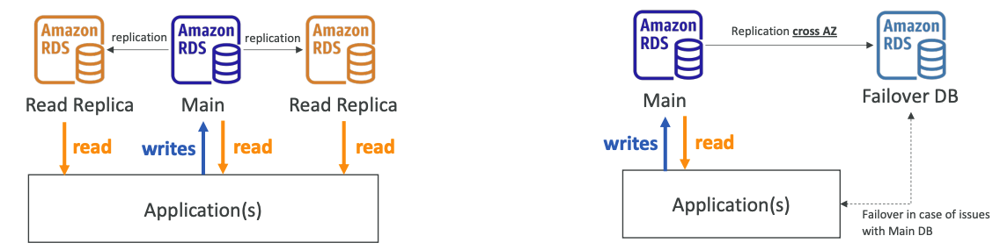
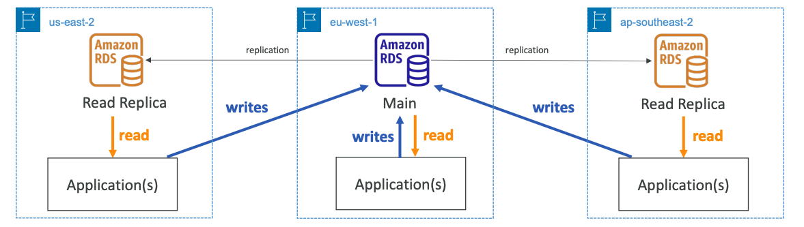
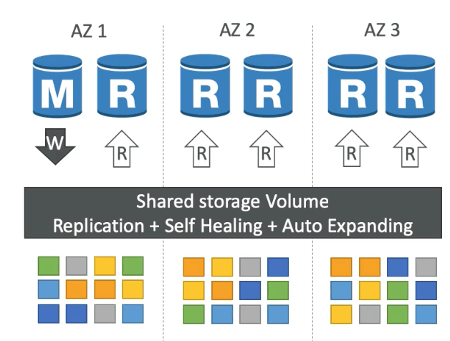
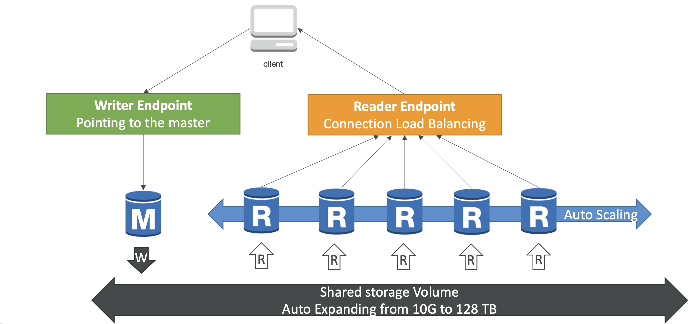
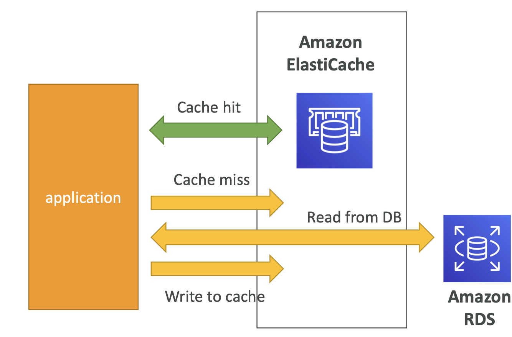
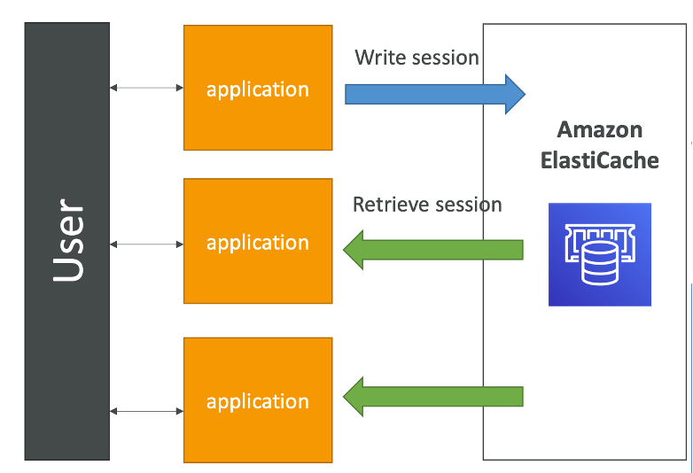
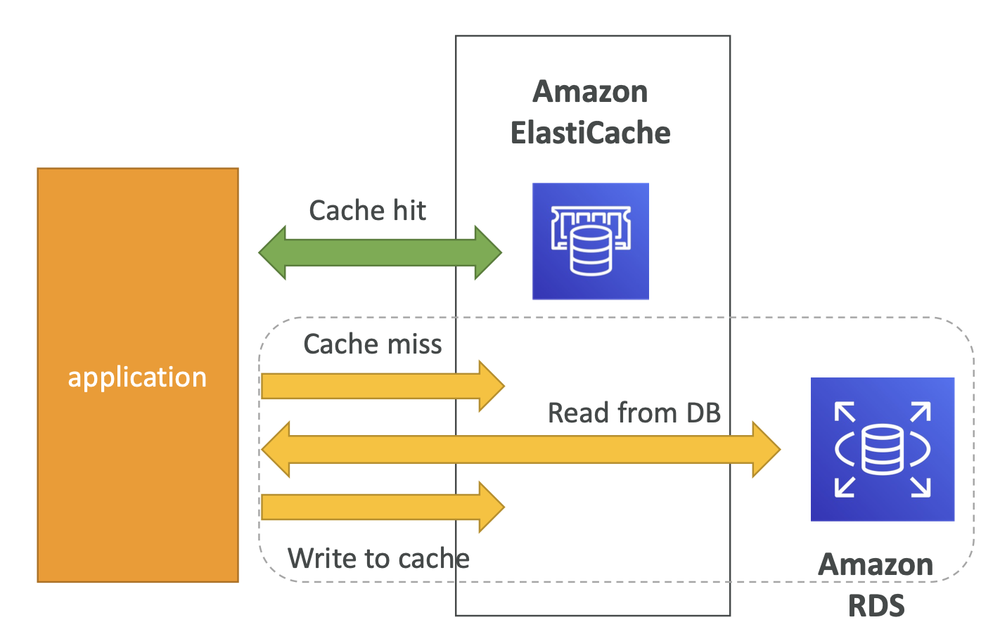
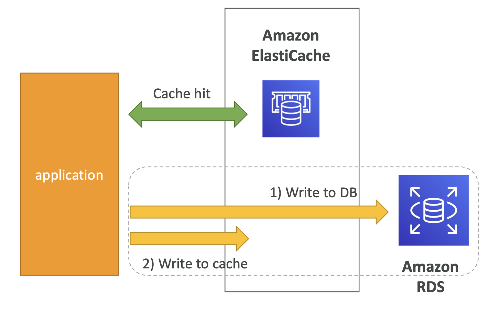

# RDS, Aurora & ElastiCache

- [RDS, Aurora \& ElastiCache](#rds-aurora--elasticache)
  - [RDS Overview](#rds-overview)
    - [Advantage over using RDS versus deploying DB on EC2](#advantage-over-using-rds-versus-deploying-db-on-ec2)
    - [RDS - Storage Auto Scaling](#rds---storage-auto-scaling)
    - [RDS Read Replicas for read scalability](#rds-read-replicas-for-read-scalability)
      - [Read Replicas - Use Cases](#read-replicas---use-cases)
      - [Read Replicas - Network Cost](#read-replicas---network-cost)
    - [RDS Multi AZ (Disaster Recovery)](#rds-multi-az-disaster-recovery)
      - [RDS - From Single-AZ to Multi-AZ](#rds---from-single-az-to-multi-az)
  - [RDS Custom](#rds-custom)
  - [Amazon Aurora](#amazon-aurora)
    - [Aurora High Availability and Read Scaling](#aurora-high-availability-and-read-scaling)
    - [Aurora DB Cluster](#aurora-db-cluster)
    - [Features of Aurora](#features-of-aurora)
  - [RDS \& Aurora Security](#rds--aurora-security)
  - [Amazon ElastiCache Overview](#amazon-elasticache-overview)
    - [ElastiCache Solution Architecture - DB Cache](#elasticache-solution-architecture---db-cache)
    - [ElastiCache Solution Architecture - User Session Store](#elasticache-solution-architecture---user-session-store)
    - [ElastiCache - Redis vs Memcached Replication](#elasticache---redis-vs-memcached-replication)
    - [ElastiCache - Cache Security](#elasticache---cache-security)
    - [ElastiCache Replication: Cluster Mode Disabled](#elasticache-replication-cluster-mode-disabled)
    - [ElastiCache Replication: Cluster Mode Enabled](#elasticache-replication-cluster-mode-enabled)
    - [Caching Implementation Considerations](#caching-implementation-considerations)
    - [Lazy Loading / Cache-Aside / Lazy Population](#lazy-loading--cache-aside--lazy-population)
    - [Write Through - Add or Update cache when database is updated](#write-through---add-or-update-cache-when-database-is-updated)
    - [Cache Evictions and Time-to-live (TTL)](#cache-evictions-and-time-to-live-ttl)
    - [Which caching design pattern is the most appropriate?](#which-caching-design-pattern-is-the-most-appropriate)
    - [Amazon MemoryDB for Redis](#amazon-memorydb-for-redis)

## RDS Overview

- RDS stands for Relational Database Service
- It’s a managed DB service for DB use SQL as a query language.
- It allows you to create databases in the cloud that are managed by AWS
  - Postgres
  - MySQL
  - MariaDB
  - Oracle
  - Microsoft SQL Server
  - Aurora (AWS Proprietary database)

### Advantage over using RDS versus deploying DB on EC2

- RDS is a managed service:
  - Automated provisioning, OS patching
  - Continuous backups and restore to specific timestamp (Point in Time Restore)!
  - Monitoring dashboards
  - Read replicas for improved read performance
  - Multi AZ setup for DR (Disaster Recovery)
  - Maintenance windows for upgrades
  - Scaling capability (vertical and horizontal)
  - Storage backed by EBS (gp2 or io1)
- BUT you can’t SSH into your instances

### RDS - Storage Auto Scaling

- Helps you increase storage on your RDS DB instance dynamically
- When RDS detects you are running out of free database storage, it scales automatically
- Avoid manually scaling your database storage
- You have to set Maximum Storage Threshold (maximum limit for DB storage)
- Automatically modify storage if:
  - Free storage is less than 10% of allocated storage
  - Low-storage lasts at least 5 minutes
  - 6 hours have passed since last modification
- Useful for applications with unpredictable workloads
- Supports all RDS database engines (MariaDB, MySQL, PostgreSQL, SQL Server, Oracle)

### RDS Read Replicas for read scalability

- Up to 5 Read Replicas
- Within AZ, Cross AZ or Cross Region
- Replication is ASYNC, so reads are eventually consistent
- Replicas can be promoted to their own DB
- Applications must update the connection string to leverage read replicas

#### Read Replicas - Use Cases
  
- You have a production database that is taking on normal load
- You want to run a reporting application to run some analytics
- You create a Read Replica to run the new workload there
- The production application is unaffected
- Read replicas are used for SELECT (=read) only kind of statements (not INSERT, UPDATE, DELETE)

#### Read Replicas - Network Cost

- In AWS there’s a network cost when data goes from one AZ to another
- For RDS Read Replicas within the same region, you don’t pay that fee

### RDS Multi AZ (Disaster Recovery)

- SYNC replication
- One DNS name – automatic app failover to standby
- Increase availability
- Failover in case of loss of AZ, loss of network, instance or storage failure
- No manual intervention in apps
- Not used for scaling
- Multi-AZ replication is free
- Note:The Read Replicas be setup as Multi AZ for Disaster Recovery (DR)

#### RDS - From Single-AZ to Multi-AZ

- Zero downtime operation (no need to stop the DB)
- Just click on “modify” for the database
- The following happens internally:
  - A snapshot is taken
  - A new DB is restored from the snapshot in a new AZ
  - Synchronization is established between the two databases

| Read Replicas                       | Multi-AZ                                          |
| ----------------------------------- | ------------------------------------------------- |
| Scale the read workload of your DB  | Failover in case of AZ outage (high availability) |
| Can create up to 5 Read Replicas    | Data is only read/written to the main database    |
| Data is only written to the main DB | Can only have 1 other AZ as failover              |

- **Read Replicas**

- **Multi-Region**

## RDS Custom

- Managed Oracle and Microsoft SQL Server Database with OS and database customization
- RDS: Automates setup, operation, and scaling of database in AWS
- Custom: access to the underlying database and OS so you can
  - Configure settings
  - Install patches
  - Enable native features
  - Access the underlying EC2 Instance using SSH or SSM Session Manager
- De-activate Automation Mode to perform your customization, better to take a DB snapshot before
- RDS vs. RDS Custom
  - RDS: entire database and the OS to be managed by AWS
  - RDS Custom: full admin access to the underlying OS and the database

## Amazon Aurora

- Aurora is a proprietary technology from AWS (not open sourced)
- Postgres and MySQL are both supported as Aurora DB (that means your drivers will work as if Aurora was a Postgres or MySQL database)
- Aurora is “AWS cloud optimized” and claims 5x performance improvement over MySQL on RDS, over 3x the performance of Postgres on RDS
- Aurora storage automatically grows in increments of 10GB, up to 128 TB.
- Aurora can have 15 replicas while MySQL has 5, and the replication process is faster (sub 10 ms replica lag)
- Failover in Aurora is instantaneous. It’s HA (High Availability) native.
- Aurora costs more than RDS (20% more) – but is more efficient

### Aurora High Availability and Read Scaling

- 6 copies of your data across 3 AZ:
  - 4 copies out of 6 needed for writes
  - 3 copies out of 6 need for reads
  - Self healing with peer-to-peer replication
  - Storage is striped across 100s of volumes
- One Aurora Instance takes writes (master)
- Automated failover for master in less than 30 seconds
- Master + up to 15 Aurora Read Replicas serve reads
- **Support for Cross Region Replication**

### Aurora DB Cluster

- An Aurora DB cluster is a group of one or more Aurora instances that function as a single, highly-available database.
- The cluster is managed by Aurora and automatically handles tasks such as replication, backups, and failure detection.
- Aurora also provides a feature called Aurora Global Database, which allows you to create a single Aurora database that spans multiple AWS regions for even higher availability and disaster recovery.

### Features of Aurora

- Automatic fail-over
- Backup and Recovery
- Isolation and security
- Industry compliance
- Push-button scaling
- Automated Patching with Zero Downtime
- Advanced Monitoring
- Routine Maintenance
- Backtrack: restore data at any point of time without using backups

## RDS & Aurora Security

- **At-rest encryption:**
  - Database master & replicas encryption using AWS KMS– must be defined as launch time
  - If the master is not encrypted, the read replicas cannot be encrypted
  - To encrypt an un-encrypted database, go through a DB snapshot & restore as encrypted
- **In-flightencryption:** TLS-readybydefault, use the AWS TLS root certificates client-side
- **IAM Authentication:** IAM roles to connect to your database (instead of username/pw)
- **Security Groups:** Control Network access to your RDS / Aurora DB
- **No SSH available** except on RDS Custom
- **Audit Logs can be enabled** and sent to CloudWatch Logs for longer retention

## Amazon ElastiCache Overview

- The same way RDS is to get managed Relational Databases.
- ElastiCache is to get managed Redis or Memcached
- Caches are in-memory databases with really high performance, low latency
- Helps reduce load off of databases for read intensive workloads
- Helps make your application stateless
- AWS takes care of OS maintenance / patching, optimizations, setup, configuration, monitoring, failure recovery and backups
- Using ElastiCache involves heavy application code changes

### ElastiCache Solution Architecture - DB Cache

- Applications queries ElastiCache, if not available, get from RDS and store in ElastiCache.
- Helps relieve load in RDS
- Cache must have an invalidation strategy to make sure only the most current data is used in there.

### ElastiCache Solution Architecture - User Session Store

- User logs into any of the application
- The application writes the session data into ElastiCache
- The user hits another instance of our application
- The instance retrieves the data and the user is already logged in

### ElastiCache - Redis vs Memcached Replication

| REDIS                                                   | MEMCACHED                                      |
| ------------------------------------------------------- | ---------------------------------------------- |
| Multi AZ with Auto-Failover                             | Multi-node for partitioning of data (sharding) |
| Read Replicas to scale reads and have high availability | No high availability (replication)             |
| Data Durability using AOF persistence                   | Non persistent                                 |
| Backup and restore features                             | No backup and restore                          |
|                                                         | Multi-threaded architecture                    |

### ElastiCache - Cache Security

- All caches in ElastiCache:
  - **Do not support IAM authentication**
  - IAM policies on ElastiCache are only used for AWS API-level security
- **Redis AUTH**
  - You can set a "password/token" when you create a Redis cluster
  - This is an extra level of security for your cache (on top of security groups)
  - Support SSL in flight encryption
- Memcached
  - Supports SASL-based authentication (advanced)

### ElastiCache Replication: Cluster Mode Disabled

- One primary node, up to 5 replicas
- Asynchronous Replication
- The primary node is used for read/write
- The other nodes are read-only
- **One shard, all nodes have all the data**
- Guard against data loss if node failure
- Multi-AZ enabled by default for failover
- Helpful to scale read performance

### ElastiCache Replication: Cluster Mode Enabled

- **Data is partitioned across shards (helpful to scale writes)**
- Each shard has a primary and up to 5 replica nodes (same concept as before)
- Multi-AZ capability
- Up to 500 nodes per cluster:
  - 500 shards with single master
  - 250 shards with 1 master and 1 replica
  - 83 shards with one master and 5 replicas

### Caching Implementation Considerations

- Read more at: <https://aws.amazon.com/caching/implementation-considerations/>
- **Is it safe to cache data?** Data may be out of date, eventually consistent
- **Is caching effective for that data?**
  - Pattern: data changing slowly, few keys are frequently needed
  - Anti patterns: data changing rapidly, all large key space frequently needed
- **Is data structured well for caching?**
  - example: key value caching, or caching of aggregations results
- Which caching design pattern is the most appropriate?

### Lazy Loading / Cache-Aside / Lazy Population

| Pros                                                                       | Cons                                                                                |
| -------------------------------------------------------------------------- | ----------------------------------------------------------------------------------- |
| Only requested data is cached (the cache isn’t filled up with unused data) | Cache miss penalty that results in 3 round trips, noticeable delay for that request |
| Node failures are not fatal (just increased latency to warm the cache)     | Stale data: data can be updated in the database and outdated in the cache           |

### Write Through - Add or Update cache when database is updated

| Pros                                                        | Cons                                                                                                         |
| ----------------------------------------------------------- | ------------------------------------------------------------------------------------------------------------ |
| Data in cache is never stale, reads are quick               | Missing Data until it is added / updated in the DB. Mitigation is to implement Lazy Loading strategy as well |
| Write penalty vs Read penalty (each write requires 2 calls) | Cache churn – a lot of the data will never be read                                                           |

### Cache Evictions and Time-to-live (TTL)

- Cache eviction can occur in three ways:
  - You delete the item explicitly in the cache
  - Item is evicted because the memory is full and it’s not recently used (LRU)
  - Yousetanitemtime-to-live(orTTL)
- TTL are helpful for any kind of data:
  - Leaderboards
  - Comments
  - Activity streams
- TTL can range from few seconds to hours or days
- If too many evictions happen due to memory, you should scale up or out

### Which caching design pattern is the most appropriate?

- Lazy Loading / Cache aside is easy to implement and works for many situations as a foundation, especially on the read side
- Write-through is usually combined with Lazy Loading as targeted for the queries or workloads that benefit from this optimization
- Setting a TTL is usually not a bad idea, except when you’re using Write-through. Set it to a sensible value for your application
- Only cache the data that makes sense (user profiles, blogs, etc...)

### Amazon MemoryDB for Redis

- Redis-compatible, durable, in-memory database service
- Ultra-fast performance with over 160 millions requests/second
- Durable in-memory data storage with Multi-AZ transactional log
- Scale seamlessly from 10s GBs to 100s TBs of storage
- Use cases: web and mobile apps, online gaming, media streaming

* * *

[👈  Elastic Load Balancing & Auto Scaling Groups](./elb_asg.md)&nbsp; &nbsp; &nbsp; &nbsp; &nbsp; &nbsp;[Home](../README.md)&nbsp; &nbsp; &nbsp; &nbsp; &nbsp; &nbsp;[Route 53 👉](./route_53.md)
